# Диаграммы проекта: TG_BOT_Chvetyk (Mini App + Posiflora + Поддержка)

Подробные UML-диаграммы в Mermaid: компоненты, потоки данных, БД, API, фронтенд, бот, интеграции Posiflora, вкладка «Поддержка» и супергруппа.

---

## 1. Компонентная диаграмма (высокоуровневая)

```
┌─────────────────────────────────────────────────────────────────────────────────────────┐
│                                    TELEGRAM                                               │
│  ┌─────────────────┐    ┌─────────────────────────────────────────────────────────────┐  │
│  │   Telegram Bot  │    │              Mini App (WebView, React)                       │  │
│  │   (Telegraf)    │    │  Catalog | Product | Cart | Checkout | Profile | About       │  │
│  │ /start, /menu   │    │  BottomNav: Каталог, Корзина, Профиль, О нас                 │  │
│  │ кнопки меню     │    │  Profile: Адреса | Заказы | Поддержка                        │  │
│  │ callback        │    │  initData (Telegram) → API (X-Telegram-Init-Data)            │  │
│  └────────┬────────┘    └────────────────────────────┬────────────────────────────────┘  │
│           │                                            │                                   │
│           │         ┌──────────────────────────────────┘                                  │
│           │         │                                                                       │
│           ▼         ▼                                                                       │
│  ┌─────────────────────────────────────────────────────────────────────────────────────┐  │
│  │                    Супергруппа (MANAGER_GROUP_CHAT_ID)                               │  │
│  │  • Общий чат заказов: уведомления о заказах, чеки, кнопки [✅ Подтвердить] [❌ Нет]  │  │
│  │  • Чаты с клиентами: по 1 чату на клиента при первом запросе в «Поддержка» (один    │  │
│  │    раз создаётся, потом переиспользуется). Общение клиента — в боте, не в группе.   │  │
│  └─────────────────────────────────────────────────────────────────────────────────────┘  │
└─────────────────────────────────────────────────────────────────────────────────────────┘
                                         │
                                         │ HTTPS / Webhook
                                         ▼
┌─────────────────────────────────────────────────────────────────────────────────────────┐
│                         BACKEND (Node.js, Express)                                        │
│  API: /api/products, /api/categories, /api/cart, /api/orders, /api/bonus,                │
│       /api/users, /api/pickup, /api/config                                                 │
│  Middlewares: telegram-auth, rate-limit, validate-request, error-handler                 │
│  /api/telegram/webhook (POST) — fallback для бота                                         │
└───────┬──────────────────────────────────────┬───────────────────────┬─────────────────┘
        │                                      │                         │
        ▼                                      ▼                         ▼
┌───────────────┐  ┌─────────────────┐  ┌─────────────────────────────────────────────────┐
│  PostgreSQL   │  │     Redis       │  │  ВНЕШНИЕ СИСТЕМЫ                                │
│  users        │  │  кэш products,  │  │  • Posiflora — склад и витрина каталога,        │
│  products     │  │  categories     │  │    база клиентов (по телефону), бонусы,         │
│  categories   │  │  rate-limit     │  │    приём заказов с составом                     │
│  orders       │  └─────────────────┘  │                                                   │
│  order_items  │                      │                                                   │
│  carts        │                      │                                                   │
│  bonus_history│                      └─────────────────────────────────────────────────┘
│  pickup_points│
│  order_status_│
│  history      │
└───────────────┘
```

---

## 1.1. Сводная схема: откуда что берётся и куда уходит

| № | Откуда | Куда | Запрос / Действие (что шлём) | Ответ / Результат (что получаем) |
|---|--------|------|------------------------------|----------------------------------|
| **1** | Backend | Posiflora API | **GET** каталог/категории/товары | name, price, images, description, in_stock, category → `products`, `categories` |
| **2** | Mini App | Backend | **GET** /api/products, /api/categories, /api/products/:id | **data:** товары, категории; карточка — витрина в Catalog, Product |
| **3** | Backend | Posiflora API | **getClient(phone)**. Если телефон в TG — сразу; иначе после ⑦: customer_phone, customer_name | client_id, name → `users`; обновление/создание по `phone` |
| **4** | Backend | Posiflora API | **getBonusBalance(phone, ФИО)**, суммы заказов по категориям | balance → `users.bonus_balance`, `bonus_history`; отображение в Profile, Checkout |
| **5** | Mini App | Backend | **POST** /api/orders { customer, delivery, recipient, items } | { id, order_number, status }; Backend → `orders`, `order_items`; **Posiflora createOrder** (полный состав); супергруппа (ожидание оплаты, чек, кнопки) |
| **6** | Супергруппа (менеджер) | Backend (Webhook) | callback_query: **payment_confirm:N** или **payment_reject:N** | Backend: UPDATE `orders` (payment_status, status), INSERT `order_status_history`; answerCbQuery; бот: ЛС клиенту |
| **7** | Profile (кнопка «Поддержка») | Backend → Супергруппа | Найти/создать тред по user_id (support_threads.supergroup_topic_id) | Один тред на клиента; общение клиента — в боте |
| **8** | Mini App (Zustand) | LocalStorage | addItem, removeItem, updateQuantity (persist) | Корзина для Checkout; на бэкенд не уходит до ⑤ (cart API — заглушки) |

---

## 2. Диаграмма классов БД (таблицы и поля)

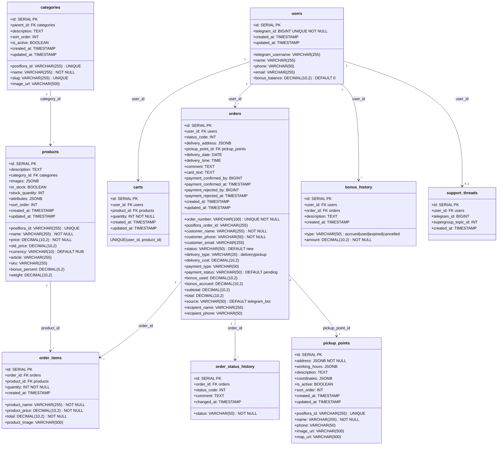

---

## 3. API Backend — маршруты, методы и поля

| № | Откуда | Куда | Запрос / Действие (что шлём) | Ответ / Результат (что получаем) |
|---|--------|------|------------------------------|----------------------------------|
| **1** | Mini App | Backend | **GET** /api/products. query: categoryId, categorySlug, search, inStock, minPrice, maxPrice, page, limit, sort | `{ data: Product[], pagination }` |
| **2** | Mini App | Backend | **GET** /api/products/:id. params: id | `Product` |
| **3** | Mini App | Backend | **GET** /api/categories | `Category[]` |
| **4** | Mini App | Backend | **GET** /api/categories/:id. params: id | `Category` |
| **5** | Mini App | Backend | **GET** /api/cart (auth: telegram). query: userId | `{ userId, items, total }` (пока заглушка) |
| **6** | Mini App | Backend | **POST** /api/cart (auth: telegram). body: {} | `{ message }` (заглушка) |
| **7** | Mini App | Backend | **DELETE** /api/cart/:productId (auth: telegram). params: productId | `{ message }` (заглушка) |
| **8** | Mini App | Backend | **POST** /api/orders (auth: telegram). body: createOrderSchema | `{ id, order_number, total, status, payment_status, createdAt }` |
| **9** | Mini App | Backend | **GET** /api/orders (auth: telegram) | `{ orders: [{ id, order_number, total, status, payment_status, created_at }] }` |
| **10** | Mini App | Backend | **GET** /api/orders/:id (auth: telegram). params: id | заказ + items + history |
| **11** | Mini App | Backend | **POST** /api/orders/:id/receipt (auth: telegram). params: id; body: `{ imageDataUrl, fileName? }` | `{ ok: true }` → в супергруппу чек + кнопки |
| **12** | Mini App | Backend | **GET** /api/bonus/balance (auth: telegram). query: userId | `{ userId, balance, message }` (заглушка до Posiflora) |
| **13** | Mini App | Backend | **POST** /api/bonus/calculate (auth: telegram). body: {} | `{ bonusesToAccrue, message }` (заглушка) |
| **14** | Mini App | Backend | **GET** /api/users/:telegramId (auth: telegram). params: telegramId | пользователь |
| **15** | Mini App | Backend | **GET** /api/pickup/points (auth: telegram) | `[]` (заглушка до Posiflora) |
| **16** | Mini App | Backend | **POST** /api/pickup/calculate (auth: telegram). body: {} | `{ deliveryCost, message }` (заглушка) |
| **17** | Mini App | Backend | **GET** /api/config | `{ brand, delivery, contacts, ... }` |

### Схема `createOrderSchema` (body POST /api/orders)

```yaml
customer: { name, phone, email? }
delivery:
  type: delivery | pickup
  address: { city, street, house, apartment?, postalCode? }  # если delivery
  pickupPointId?: number  # если pickup
  date: string
  time: string
recipient: { name, phone }
cardText: string
comment?: string
paymentType: card_requisites | sbp_qr
items: [ { productId, productName, price, quantity, image? } ]
```

---

## 4. Frontend — страницы, навигация, хранилища

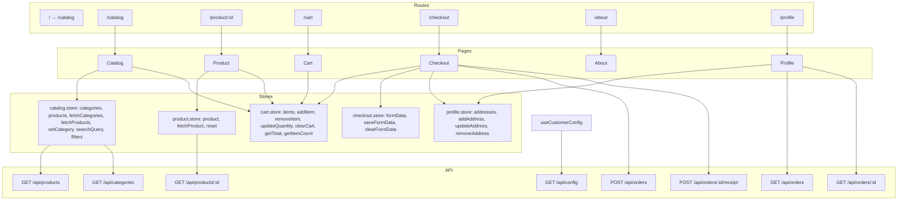

### Профиль — вкладки

| № | Откуда | Куда | Запрос / Действие (что шлём) | Ответ / Результат (что получаем) |
|---|--------|------|------------------------------|----------------------------------|
| **1** | Profile (вкладка «Адреса») | profile.store (localStorage) | addAddress, updateAddress, removeAddress | Адреса в store; отображение в Checkout |
| **2** | Profile (вкладка «Заказы») | Backend | **GET** /api/orders (auth) | `{ orders: [{ id, order_number, total, status, payment_status, created_at }] }` |
| **3** | Profile (вкладка «Заказы», «Подробнее») | Backend | **GET** /api/orders/:id (auth). params: id | заказ + items + history; детали + история статусов |
| **4** | Profile (вкладка «Поддержка») | Backend → Супергруппа | Кнопка «Написать в поддержку»: найти/создать тред по user_id (support_threads.supergroup_topic_id) | Один тред на клиента; общение клиента — в боте |

### BottomNavigation

- Каталог → `/catalog`
- Корзина → `/cart`
- Профиль → `/profile`
- О нас → `/about`

---

## 5. Бот — команды, обработчики, callback

```mermaid
flowchart LR
    subgraph Commands
        start["/start"]
        menu["/menu"]
        help["/help"]
    end

    subgraph Handlers
        handleStart["start.ts: приветствие, кнопка 'Открыть каталог' (WebApp)"]
        handleMenu["menu.ts: кнопка WebApp каталог"]
        handleMessage["message.handler: СТАРТ, Мои заказы, Мои бонусы, О нас, Помощь"]
        handleCallback["callback.handler: payment_confirm:N, payment_reject:N"]
        handleWebApp["webapp.handler: данные из Mini App"]
    end

    subgraph Notifications
        notifyManagerPaymentRequest["order.notifications → супергруппа: ожидание оплаты"]
        notifyManagerPaymentReceipt["manager.notifications: чек + кнопки [✅][❌] в супергруппу"]
        notifyOrderStatusUpdate["order.notifications: клиенту в ЛС при смене статуса"]
    end

    start --> handleStart
    menu --> handleMenu
    "текст сообщения" --> handleMessage
    "callback_query" --> handleCallback
    "WebApp data" --> handleWebApp

    orders.create --> notifyManagerPaymentRequest
    orders.uploadReceipt --> notifyManagerPaymentReceipt
    callback "confirm/reject" --> orders UPDATE
    callback "confirm/reject" --> notifyOrderStatusUpdate
```

### Callback `payment_confirm:N` / `payment_reject:N`

- Приходит из супергруппы (проверка `message.chat.id === MANAGER_GROUP_CHAT_ID`).
- `payment_confirm` → `payment_status=confirmed`, `status=confirmed`, `payment_confirmed_by`, `payment_confirmed_at`; `order_status_history`.
- `payment_reject` → `payment_status=rejected`, `status=cancelled`, `payment_rejected_by`, `payment_rejected_at`; `order_status_history`.
- Клиенту в ЛС: «Оплата подтверждена» / «Оплата не прошла».
- Редактирование сообщения в группе: убрать кнопки, дописать «Оплата подтверждена/не прошла», менеджер, время.

---

## 6. Интеграция Posiflora

```mermaid
flowchart TB
    subgraph Posiflora
        P_clients["База клиентов"]
        P_bonuses["Бонусы по: сумма заказов, категории, телефон, ФИО"]
        P_orders["CRM: заказы с полным составом"]
    end

    subgraph Our_DB
        users
        orders
        order_items
        bonus_history
    end

    subgraph Sync_Logic
        by_phone["Сопоставление по номеру телефона"]
        if_tg_phone["Телефон есть в профиле TG?"]
        after_first["После первого заказа: телефон + имя из заказа"]
        bonus_calc["Бонусы: по сумме заказов по категориям, телефон, ФИО — полное сопоставление с Posiflora"]
        send_order["После создания заказа: отправить в Posiflora состав заказа (товары, суммы, доставка, получатель и т.д.)"]
    end

    P_clients --> by_phone
    by_phone --> if_tg_phone
    if_tg_phone -->|да| "Сразу использовать профиль Posiflora"
    if_tg_phone -->|нет| after_first
    after_first --> users
    users --> P_clients

    orders --> bonus_calc
    bonus_calc --> P_bonuses
    P_bonuses --> users
    users --> bonus_balance

    orders --> send_order
    order_items --> send_order
    send_order --> P_orders
```

### Поля для сопоставления с Posiflora

- **Клиент:** `phone` (основной ключ). Если в `users` есть `phone` из Telegram/профиля — сразу ищем в Posiflora. Иначе — после первого заказа: `customer_phone`, `customer_name` → обновить `users` и связать с Posiflora.
- **Бонусы:** по `phone`, `name` (ФИО), суммы заказов по категориям → расчёт в Posiflora; результат — в `users.bonus_balance` и/или `bonus_history`.
- **Заказ в CRM:** после `POST /api/orders` — вызов API Posiflora: состав (order_items: product_name, product_price, quantity, total), доставка, получатель, комментарий, источник `telegram_mini_app`, `posiflora_order_id` сохранять в `orders.posiflora_order_id`.

### Posiflora API: минимальный набор для синхронизации (по UML)

Базовый URL: `https://<your-posiflora-domain>/api/v1`. Формат: `application/vnd.api+json`. Авторизация: `Bearer <accessToken>`.

| Поток UML | Метод | Endpoint | Что делаем | Примечания |
|---|---|---|---|---|
| Auth | **POST** | `/sessions` | Создать сессию | Тело: `{ data: { type:"sessions", attributes:{ username, password }}}` |
| Auth | **PATCH** | `/sessions` | Обновить токен | Тело: `{ data: { type:"sessions", attributes:{ refreshToken }}}` |
| ⑫ | **POST** | `/customers/filter-phone-numbers` | Быстрая проверка наличия телефонов | Тело: `{ data:{ type:"customer-phone-numbers", attributes:{ phoneNumbers:[...] }}}` |
| ⑫ | **GET** | `/customers?search=<phone>` | Найти клиента по телефону | `search` ищет по имени/телефону/карте |
| ⑫ | **GET** | `/customers/{id}` | Получить карточку клиента | Нужен `id` из списка |
| ⑫ | **POST** | `/customers` | Создать клиента при отсутствии | Тело: `data.type="customers"`, `attributes:{ title, phone, email?, birthday?, gender?, countryCode? }` |
| ⑫ | **PATCH** | `/customers/{id}` | Обновить клиента | Например, добавить имя/телефон/почту |
| ⑬ | **GET** | `/customers/{id}/bonus-history` | История бонусов | Возвращает начисления/списания |
| ⑭ | **POST** | `/orders` | Создать заказ в CRM | Передаём состав, суммы, доставку, получателя, source |
| (опц.) | **GET** | `/order-sources` | Справочник источников | Для поля `source` в заказе |

---

## 8. Поддержка: вкладка в профиле и супергруппа

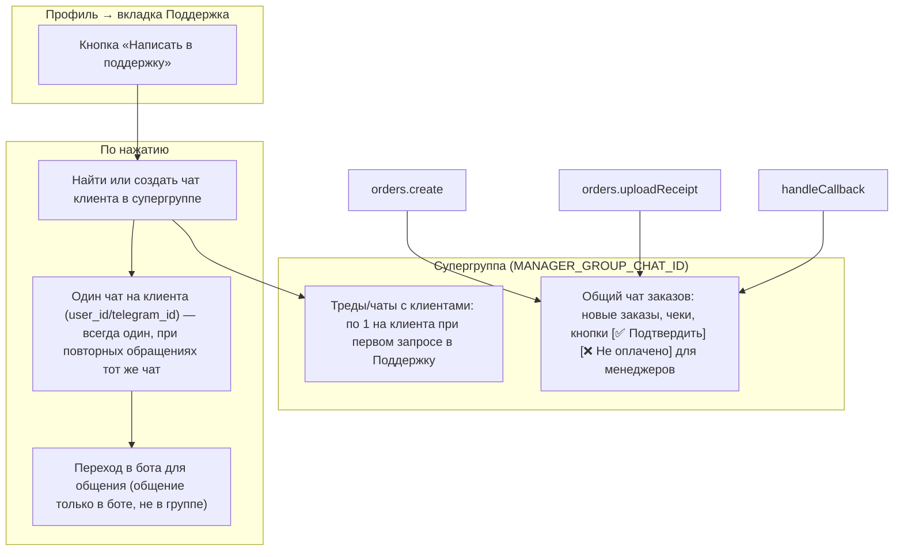

### Поведение

- **Вкладка «Поддержка»:** кнопка «Написать в поддержку». По нажатию:
  - Найти или создать в супергруппе тред (topic) под этого клиента. Хранить `(user_id или telegram_id) → topic_id` в БД или конфиге, чтобы всегда использовать один и тот же тред.
  - Общение клиента — только в боте (в ЛС с ботом). В супергруппе пишут менеджеры; при необходимости — ретрансляция сообщений клиента из бота в тред.
- **Супергруппа:**
  - **Общий чат заказов (основной тред или без топика):** `notifyManagerPaymentRequest`, `notifyManagerPaymentReceipt` с кнопками. Callback `payment_confirm` / `payment_reject` обрабатываются здесь.
  - **Чаты с клиентами (отдельные топики):** один топик на клиента при первом обращении в «Поддержка»; при повторных — тот же топик. Ответы — в топике; клиент общается в боте.

**Хранение «один чат на клиента»:** таблица `support_threads` (user_id, telegram_id, supergroup_topic_id) или аналог, чтобы по `user_id`/`telegram_id` находить существующий топик в супергруппе и не создавать новый.

---

## 9. Поток создания заказа (от корзины до Posiflora и супергруппы)

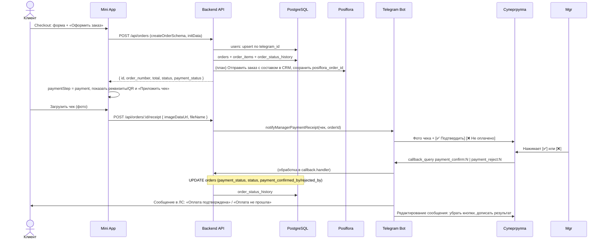

---

## 10. Синхронизация каталога и клиентов из Posiflora

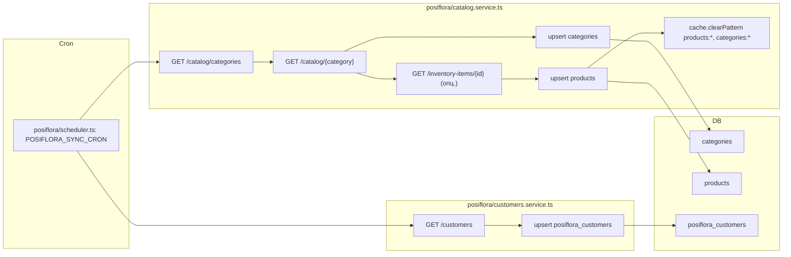

---

## 11. Конфиг и env

| Переменная | Назначение |
|------------|------------|
| `TELEGRAM_BOT_TOKEN` | Бот |
| `WEBAPP_URL` | URL Mini App |
| `MANAGER_TELEGRAM_IDS` | ЛС менеджеров (резерв, если нет группы) |
| `MANAGER_GROUP_CHAT_ID` | Супергруппа: заказы + чаты с клиентами по поддержке |
| `POSIFLORA_API_URL`, `POSIFLORA_USERNAME`, `POSIFLORA_PASSWORD` | Интеграция Posiflora |
| `POSIFLORA_SYNC_CRON`, `POSIFLORA_SYNC_ENABLED`, `POSIFLORA_SYNC_ON_STARTUP` | Синхронизация каталога |
| `POSIFLORA_CATALOG_PAGE_SIZE`, `POSIFLORA_INCLUDE_ITEM_DETAILS` | Каталог: страницы и детали |
| `POSIFLORA_CUSTOMERS_SYNC_ENABLED`, `POSIFLORA_CUSTOMERS_PAGE_SIZE` | Синхронизация клиентов |

---

## PlantUML — код для вставки

Ниже приведён код для [PlantUML](https://www.plantuml.com/plantuml). Можно вставлять каждый блок в сервис [plantuml.com](https://www.plantuml.com/plantuml/uml) или в плагин PlantUML (VS Code, IntelliJ).

---

### PlantUML: 1. Компонентная диаграмма — структура и потоки

Схема разбита на **4 зоны**. На стрелках — **номера обменов ①—⑰**; детали (что запрашивается, что возвращается) — в **таблице ниже**.

```plantuml
@startuml component
!theme plain
skinparam defaultFontSize 11
skinparam padding 8

title **Структура: 4 зоны. У стрелок — запрос → ответ; снизу — легенда ①—⑰**

' ---- ЗОНА 1: ИНТЕРФЕЙС (TELEGRAM) ----
rectangle "**1. ИНТЕРФЕЙС (Telegram)**" as Z1 #E8F4E8 {
  component [**Telegram Bot**\nTelegraf] as Bot
  component [**Mini App**\nReact, WebView] as MiniApp
  component [**Супергруппа**\nчаты заказов + треды поддержки] as Supergroup
}

' ---- ЗОНА 2: BACKEND ----
rectangle "**2. BACKEND**\nExpress, /api/*" as Z2 #E8E8F4 {
  component [**API + Posiflora sync**] as Backend
}

' ---- ЗОНА 3: ХРАНИЛИЩА ----
rectangle "**3. ХРАНИЛИЩА**" as Z3 #F4F0E8 {
  database "**PostgreSQL**\nusers, products, categories,\norders, order_items, ..." as DB
  component [**Redis**\nкэш, rate-limit] as Redis
}

' ---- ЗОНА 4: ВНЕШНИЕ API ----
rectangle "**4. ВНЕШНИЕ**" as Z4 #F4E8E8 {
  component [**Posiflora API**\nкаталог, клиенты, бонусы, заказы] as PF
}

' ===== ПОТОКИ: Mini App <-> Backend (на стрелках: запрос → ответ) =====
MiniApp -right-> Backend : **①** GET /api/products ?categoryId,search,page,limit\n→ data:[{id,name,price,images,in_stock}], pagination
MiniApp -right-> Backend : **②** GET /api/products/:id\n→ {id,name,price,images,in_stock,description}
MiniApp -right-> Backend : **③** GET /api/categories\n→ [{id,name,slug}]
MiniApp -right-> Backend : **④** GET /api/config\n→ {brand,delivery,contacts}
MiniApp -right-> Backend : **⑤** GET /api/orders\n→ {orders:[{id,order_number,total,status}]}
MiniApp -right-> Backend : **⑥** GET /api/orders/:id\n→ {id,items,history,delivery,recipient}
MiniApp -right-> Backend : **⑦** POST /api/orders {customer,delivery,recipient,items}\n→ {id,order_number,status,payment_status}
MiniApp -right-> Backend : **⑧** POST /api/orders/:id/receipt {imageDataUrl}\n→ {ok}; Backend шлёт чек в ⑯

Backend -left-> MiniApp : ответы ①—⑧: data / id,order_number,status / {ok}

' ===== ПОТОКИ: Bot <-> Backend =====
Bot -down-> Backend : **⑨** Webhook callback_query: payment_confirm:N | payment_reject:N\n→ UPDATE orders, order_status_history; answerCbQuery; бот: ЛС клиенту + edit сообщения в группе
Backend -up-> Bot : (ответ ⑨ — в Webhook)

' ===== ПОТОКИ: Backend -> Хранилища =====
Backend -down-> DB : **⑩** SELECT/INSERT/UPDATE users,products,orders,order_items,order_status_history,carts,bonus_history,support_threads\n→ строки (id,name,price,order_number,status,...)
Backend -down-> Redis : **⑪** get/set products:*, categories:*; incr rate-limit\n→ кэш (JSON) / счётчик

' ===== ПОТОКИ: Backend -> Внешние =====
Backend -down-> PF : **⑫** getClient(phone)\n→ client_id, name
Backend -down-> PF : **⑬** getBonusBalance(phone, ФИО)\n→ balance
Backend -down-> PF : **⑭** createOrder {items,delivery,recipient,source}\n→ posiflora_order_id → пишем в orders
Backend -down-> PF : **⑮** GET /catalog/categories + /catalog/{id}\n→ пишем в products, categories (⑩)

' ===== ПОТОКИ: Backend -> Супергруппа =====
Backend -up-> Supergroup : **⑯** sendMessage/sendPhoto: order_number,customer,items,чек; кнопки [✅][❌]\n→ сообщение в группе; нажатие → ⑨
Backend -up-> Supergroup : **⑰** тред по user_id (support_threads.supergroup_topic_id)\n→ 1 тред на клиента; общение в боте

' ===== ЛЕГЕНДА СНИЗУ: детали ①—⑰ (запрос → ответ) =====
legend bottom
  |= № |= Запрос (что шлём) |= Ответ (что получаем) |
  | ① | GET /api/products ?categoryId,search,inStock,minPrice,maxPrice,page,limit,sort | data:[{id,name,price,old_price,images,in_stock,category_id,description}], pagination |
  | ② | GET /api/products/:id | {id,name,price,old_price,images,in_stock,description,category_id,category_name,article} |
  | ③ | GET /api/categories | [{id,name,slug,image_url,sort_order}] |
  | ④ | GET /api/config | {brand:{displayName}, delivery:{city,zones}, contacts:{phone,email}} |
  | ⑤ | GET /api/orders (auth) | {orders:[{id,order_number,total,status,payment_status,created_at}]} |
  | ⑥ | GET /api/orders/:id (auth) | {id,order_number,total,status,delivery_type,delivery_address,recipient_name,recipient_phone,card_text,comment, items:[{product_name,product_price,quantity,total}], history:[{status,comment,changed_at}]} |
  | ⑦ | POST /api/orders (auth) body: customer{name,phone,email?}, delivery{type,address?,pickupPointId?,date,time}, recipient{name,phone}, cardText, paymentType, items[{productId,productName,price,quantity,image?}] | {id,order_number,total,status,payment_status,createdAt} |
  | ⑧ | POST /api/orders/:id/receipt (auth) body: {imageDataUrl,fileName?} | {ok}; side-effect: чек в Супергруппу с кнопками [✅][❌] (⑯) |
  | ⑨ | Webhook: callback_query data=payment_confirm:N | payment_reject:N, message.chat.id=MANAGER_GROUP_CHAT_ID | Backend: UPDATE orders (payment_status,status), INSERT order_status_history; answerCbQuery; бот: ЛС «Оплата подтверждена»/«не прошла», edit сообщения в группе |
  | ⑩ | SQL: SELECT/INSERT/UPDATE users,products,categories,orders,order_items,order_status_history,carts,bonus_history,pickup_points,support_threads | Строки: users{id,telegram_id,name,phone,bonus_balance}, products{id,name,price,images,in_stock,category_id}, orders{id,order_number,user_id,posiflora_order_id,total,status,payment_status,...}, order_items{...} |
  | ⑪ | get/set products:*, categories:*; incr rate-limit | Значения кэша (JSON); счётчик |
  | ⑫ | getClient(phone). Если нет в TG — после ⑦: customer_phone, customer_name | client_id, name |
  | ⑬ | getBonusBalance(phone, ФИО), суммы по категориям | balance → users.bonus_balance, bonus_history |
  | ⑭ | createOrder {items:[{name,price,quantity}], delivery, recipient, source:telegram_mini_app} (после ⑦) | posiflora_order_id → orders.posiflora_order_id |
| ⑮ | GET /catalog/categories + /catalog/{id} (Posiflora) | name,price,images,description,in_stock,category → ⑩ products, categories |
  | ⑯ | sendMessage (ожидание ⑦), sendPhoto (чек ⑧): order_number,customer_name,customer_phone,total,items; кнопки payment_confirm:N, payment_reject:N | Сообщение/фото в группе; нажатие → ⑨ |
  | ⑰ | Найти/создать тред по user_id (support_threads.supergroup_topic_id), «Поддержка» в Profile | 1 тред на клиента; общение в боте |
end legend

@enduml
```

---

### Таблица обменов: что запрашивается, откуда, что возвращается

По номерам **①—⑰** с диаграммы. По каждой строке: **откуда** → **куда**, **что отправляется/запрашивается**, **что получает обратно**.

| № | Откуда | Куда | Запрос / Действие (что шлём) | Ответ / Результат (что получаем) |
|---|--------|------|------------------------------|----------------------------------|
| **①** | Mini App | Backend | **GET** /api/products ?categoryId, categorySlug, search, inStock, minPrice, maxPrice, page, limit, sort. Заголовок: X-Telegram-Init-Data | **data:** [{ id, name, price, old_price, images, in_stock, category_id, category_name, description }], **pagination:** { page, limit, total, totalPages } |
| **②** | Mini App | Backend | **GET** /api/products/:id. Заголовок: X-Telegram-Init-Data | { id, name, price, old_price, images, in_stock, description, category_id, category_name, article } |
| **③** | Mini App | Backend | **GET** /api/categories | [{ id, name, slug, image_url, sort_order }] |
| **④** | Mini App | Backend | **GET** /api/config | { brand: { displayName }, delivery: { city, zones }, contacts: { phone, email } } |
| **⑤** | Mini App | Backend | **GET** /api/orders. Заголовок: X-Telegram-Init-Data (auth) | { orders: [{ id, order_number, total, status, payment_status, created_at }] } |
| **⑥** | Mini App | Backend | **GET** /api/orders/:id. Заголовок: X-Telegram-Init-Data (auth) | { id, order_number, total, status, payment_status, delivery_type, delivery_address, delivery_date, delivery_time, recipient_name, recipient_phone, card_text, comment, **items:** [{ product_name, product_price, quantity, total }], **history:** [{ status, comment, changed_at }] } |
| **⑦** | Mini App | Backend | **POST** /api/orders. **Body:** { **customer:** { name, phone, email? }, **delivery:** { type, address?: { city, street, house, apartment? }, pickupPointId?, date, time }, **recipient:** { name, phone }, **cardText,** **comment?,** **paymentType,** **items:** [{ productId, productName, price, quantity, image? }] }. Заголовок: X-Telegram-Init-Data (auth) | { id, order_number, total, status, payment_status, createdAt } |
| **⑧** | Mini App | Backend | **POST** /api/orders/:id/receipt. **Body:** { imageDataUrl, fileName? }. Заголовок: X-Telegram-Init-Data (auth) | { ok: true }. Бок-эффект: Backend шлёт чек в Супергруппу (**⑯**) с кнопками [✅][❌] |
| **⑨** | Telegram Bot | Backend | **Webhook** (POST). **Тело:** callback_query { data: "payment_confirm:N" или "payment_reject:N", message: { chat: { id } } }. Chat.id должен = MANAGER_GROUP_CHAT_ID | Backend: UPDATE orders (payment_status, status, payment_confirmed_by/rejected_by), INSERT order_status_history; **возврат боту:** answerCbQuery; бот шлёт клиенту в ЛС «Оплата подтверждена» / «Оплата не прошла» и редактирует сообщение в группе (убирает кнопки) |
| **⑩** | Backend | PostgreSQL | **SELECT** products, categories (с кэшем Redis), **INSERT/UPDATE** users (по telegram_id при ⑦), **INSERT** orders, order_items, order_status_history; **SELECT** orders, order_items, order_status_history при ⑤, ⑥; **UPDATE** orders при ⑨ | Строки/результаты: users{ id, telegram_id, name, phone, bonus_balance }, products{ id, name, price, images, in_stock, category_id }, orders{ id, order_number, user_id, posiflora_order_id, total, status, payment_status, ... }, order_items{ product_name, product_price, quantity, total } и т.д. |
| **⑪** | Backend | Redis | **get** products:*, categories:* (до запроса в DB); **set** после записи в DB; **incr** для rate-limit | Значения кэша (JSON) или счётчик rate-limit |
| **⑫** | Backend | Posiflora API | **Запрос клиента по phone** (getClient(phone) или аналог). Поля: phone. Если в users есть phone из TG — сразу; иначе после ①⑦: customer_phone, customer_name | client_id, name (для сопоставления users ↔ Posiflora) |
| **⑬** | Backend | Posiflora API | **Бонусы:** getBonusBalance(phone) или расчёт по заказам (категории, ФИО). Поля: phone, name; суммы заказов по категориям | balance. Backend пишет в users.bonus_balance, bonus_history |
| **⑭** | Backend | Posiflora API | **createOrder** (после ⑦). **Тело:** { items: [{ name, price, quantity }], delivery: { type, address, date, time }, recipient: { name, phone }, source: "telegram_mini_app" } | posiflora_order_id. Backend сохраняет в orders.posiflora_order_id |
| **⑮** | Backend | Posiflora API | **GET** /catalog/categories, /catalog/{id} | **Получает:** name, price, images, description, in_stock, category. Backend пишет в **products**, **categories** (⑩) |
| **⑯** | Backend | Супергруппа | **sendMessage** (ожидание оплаты по ⑦), **sendPhoto** (чек по ⑧). **Поля в сообщении:** order_number, customer_name, customer_phone, total, items; кнопки callback: payment_confirm:N, payment_reject:N | Сообщение/фото в группе; ответ при нажатии кнопки приходит как ⑨ |
| **⑰** | Backend | Супергруппа | **Создание/поиск треда** по user_id (support_threads.supergroup_topic_id). При нажатии «Поддержка» в Profile: найти или создать тред | Один тред на клиента; общение клиента — в боте, не в группе |

---

### Краткая структура таблиц PostgreSQL (для ⑩)

| № | Откуда | Куда | Запрос / Действие (что шлём) | Ответ / Результат (что получаем) |
|---|--------|------|------------------------------|----------------------------------|
| **1** | Backend | PostgreSQL | **SELECT/INSERT/UPDATE** users. Поля: id, telegram_id, telegram_username, name, phone, email, bonus_balance | Строки users (при ⑦ — по telegram_id; при ⑫,⑬ — по phone) |
| **2** | Backend | PostgreSQL | **SELECT** products (с кэшем Redis). Поля: id, posiflora_id, name, price, old_price, images, in_stock, category_id, description | Строки products для ①, ②; **INSERT/UPDATE** после ⑮ (Posiflora sync) |
| **3** | Backend | PostgreSQL | **SELECT** categories. Поля: id, posiflora_id, name, slug | Строки categories для ③; **INSERT/UPDATE** после ⑮ |
| **4** | Backend | PostgreSQL | **INSERT** orders, **SELECT** при ⑤,⑥, **UPDATE** при ⑨. Поля: id, order_number, user_id, posiflora_order_id, customer_name, customer_phone, total, status, payment_status, delivery_type, delivery_address, recipient_name, recipient_phone, card_text | Строки orders; при ⑦ — id, order_number; при ⑨ — payment_status, status |
| **5** | Backend | PostgreSQL | **INSERT** order_items при ⑦. Поля: order_id, product_id, product_name, product_price, quantity, total | Строки order_items (состав заказа) |
| **6** | Backend | PostgreSQL | **INSERT** order_status_history при ⑦, ⑨. Поля: order_id, status, comment, changed_at | История смены статусов |
| **7** | Backend | PostgreSQL | **SELECT/INSERT/UPDATE/DELETE** carts. Поля: user_id, product_id, quantity | Строки carts (заглушки API) |
| **8** | Backend | PostgreSQL | **INSERT** bonus_history при начислении/списании. Поля: user_id, order_id, type, amount | Строки bonus_history; обновление users.bonus_balance |
| **9** | Backend | PostgreSQL | **SELECT** pickup_points. Поля: id, posiflora_id, name, address | Строки pickup_points (заглушка до Posiflora) |
| **10** | Backend | PostgreSQL | **SELECT/INSERT** support_threads. Поля: user_id, telegram_id, supergroup_topic_id | Один тред на user_id для ⑰ |

---

### PlantUML: 2. Диаграмма классов БД

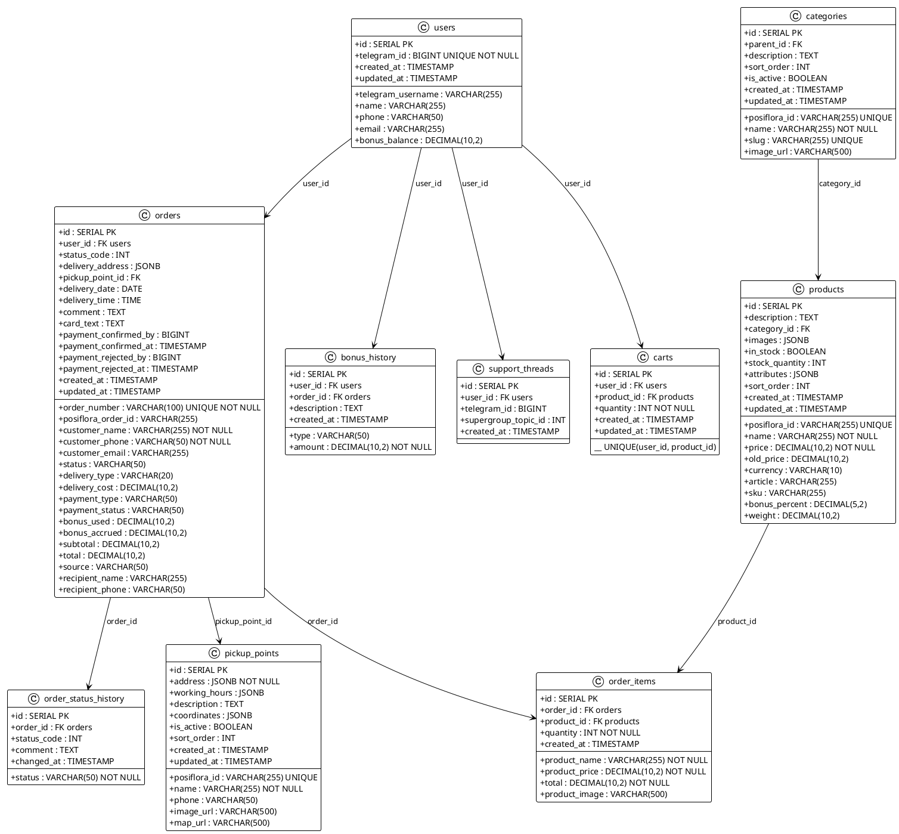

---

### PlantUML: 3. Последовательность — создание заказа

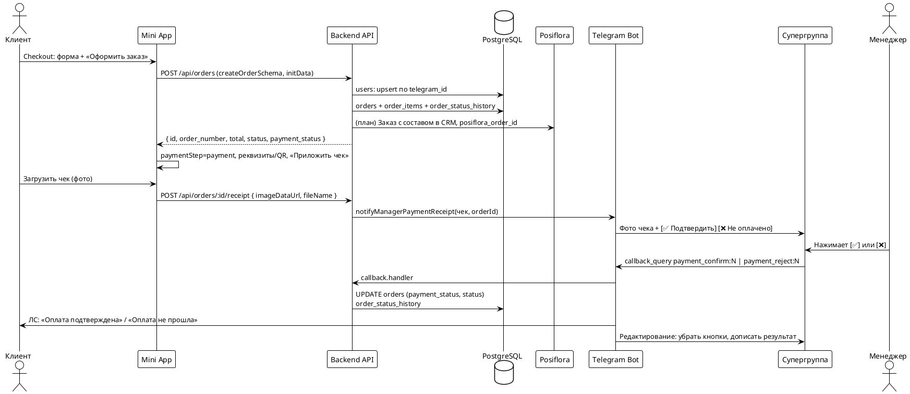

---

### PlantUML: 4. Активность — интеграция Posiflora

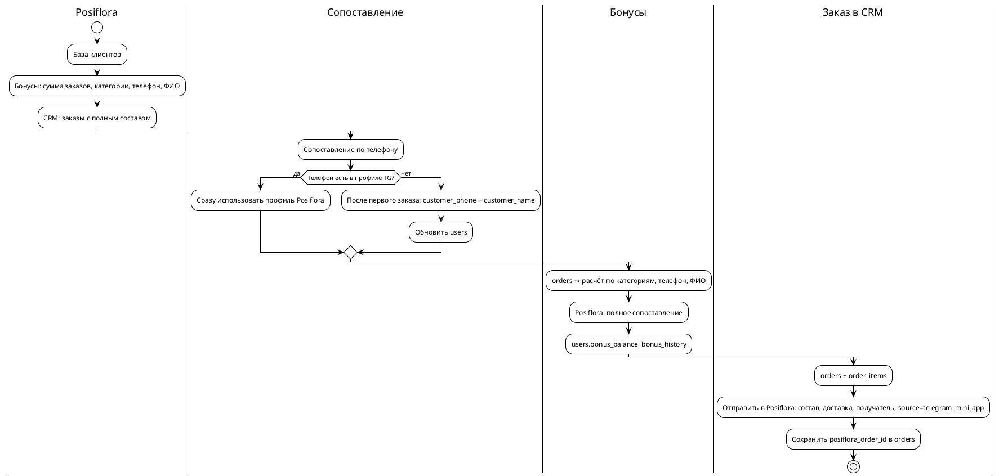

---

### PlantUML: 5. Активность — синхронизация Posiflora

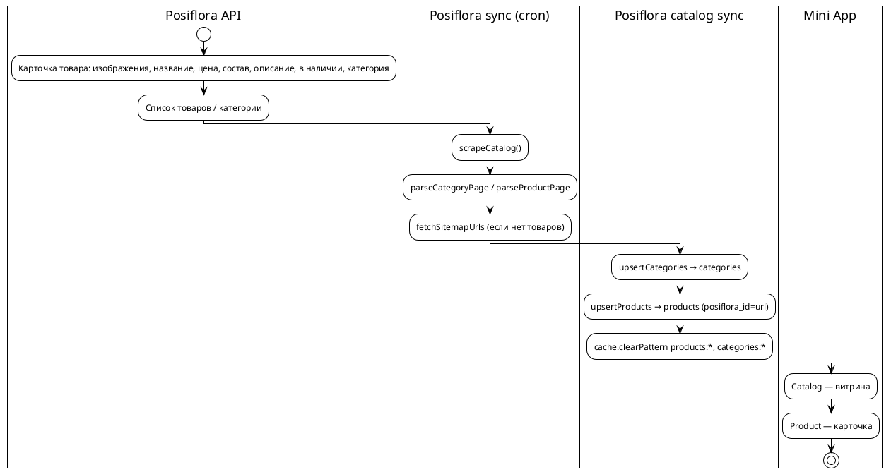

---

### PlantUML: 6. Активность — поддержка и супергруппа

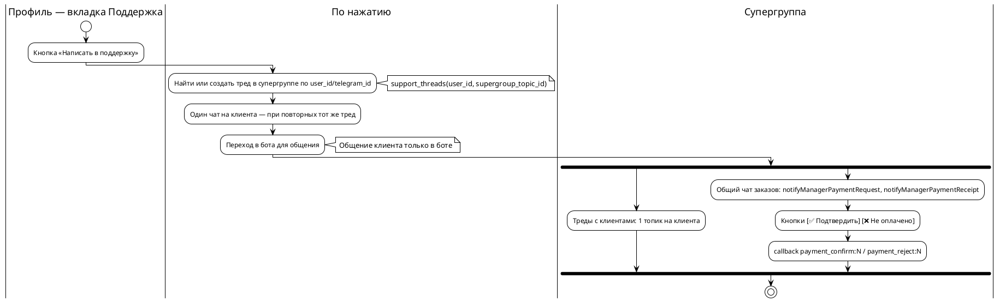

---

### PlantUML: 7. Диаграмма развёртывания (упрощённая)

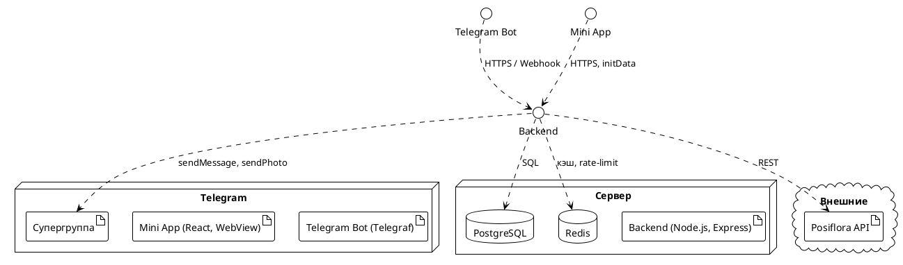

---

### PlantUML: 8. Бот — команды и обработчики

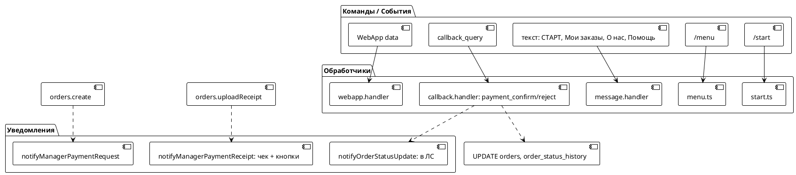

---

## Бесплатные сервисы: вставить код → получить диаграмму со связями

Ниже — инструменты, где можно вставить текстовый/код и получить изображение диаграммы с простроенными связями. Все перечисленные варианты можно использовать бесплатно.

---

### 1. Mermaid Live Editor  
**https://mermaid.live**

| Параметр | Значение |
|----------|----------|
| **Язык** | Mermaid (flowchart, sequenceDiagram, classDiagram, stateDiagram и др.) |
| **Как** | Вставить код в левую панель → справа диаграмма, экспорт PNG/SVG |
| **Связи** | `-->`, `->`, `---`, `==>`, подписи на рёбрах: `A -->\|"текст"\| B` |
| **Плюсы** | Уже есть в этом документе; рендер в GitHub, GitLab, Notion, Obsidian |

**Пример (flowchart):**
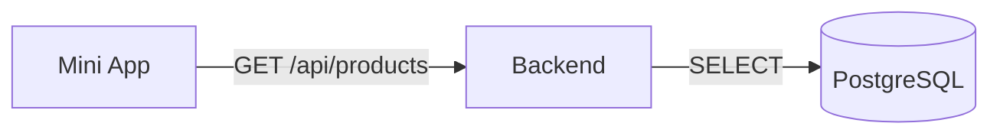

---

### 2. Kroki  
**https://kroki.io** (или **https://kroki.io/demo**)

| Параметр | Значение |
|----------|----------|
| **Языки** | PlantUML, Mermaid, GraphViz (DOT), D2, BlockDiag, BPMN, Excalidraw JSON и др. |
| **Как** | Выбрать движок (например, PlantUML) → вставить код → получить картинку. Есть REST API (GET/POST) для встраивания в приложения. |
| **Связи** | Зависят от выбранного формата (PlantUML, Mermaid и т.д.) |
| **Плюсы** | Один сервис для многих форматов; можно поднять свой instance. |

---

### 3. Draw.io (diagrams.net)  
**https://app.diagrams.net** или **https://draw.io**

| Параметр | Значение |
|----------|----------|
| **Язык** | В основном ручное рисование, но есть вставка **PlantUML** |
| **Как** | `Арrange` → `Insert` → `Advanced` → `PlantUML…` → вставить код PlantUML → сгенерируется диаграмма. Экспорт: PNG, SVG, PDF. |
| **Связи** | Строятся по коду PlantUML (компоненты, стрелки, подписи). Дальше можно двигать блоки вручную. |
| **Плюсы** | Бесплатно, без регистрации; можно хранить в Google Drive, OneDrive, на диске. |

---

### 4. PlantUML Server  
**https://www.plantuml.com/plantuml/uml**

| Параметр | Значение |
|----------|----------|
| **Язык** | PlantUML (компоненты, классы, последовательности, активности, развёртывание и др.) |
| **Как** | Вставить код между `@startuml` и `@enduml` → `Submit` → PNG/SVG. |
| **Связи** | `-->`, `->`, `-down->`, `..>`, `note`, подписи на стрелках. |
| **Плюсы** | Официальный демо-сервер; полная поддержка синтаксиса PlantUML. |

---

### 5. Graphviz (DOT)  
**https://edotor.net** или **https://viz-js.com**

| Параметр | Значение |
|----------|----------|
| **Язык** | DOT (Graphviz) |
| **Как** | Вставить код `digraph { ... }` → нажать `Run` / `Submit` → граф со связями. |
| **Связи** | `A -> B`, `A -> B [label="текст"]`, `{A B} -> C` и т.п. |
| **Плюсы** | Удобно для иерархий, графов, графов зависимостей. |

**Пример:**
```
digraph G {
  MiniApp -> Backend [label="GET /api/products"]
  Backend -> DB [label="SELECT"]
}
```

---

### 6. D2 (D2 lang)  
**https://play.d2lang.com** или CLI: `d2 diagram.d2 diagram.png`

| Параметр | Значение |
|----------|----------|
| **Язык** | D2 |
| **Как** | Вставить код в Playground → превью, экспорт PNG/SVG. |
| **Связи** | `a -> b`, `a -> b: "подпись"`, вложенность, стили. |
| **Плюсы** | Читаемый текст, приятные макеты по умолчанию. |

**Пример:**
```
a: Mini App -> b: Backend { shape: rectangle }
b -> c: PostgreSQL
```

---

### 7. Structurizr Lite (C4)  
**https://structurizr.com** (онлайн) или **Structurizr Lite** (локально, Docker)

| Параметр | Значение |
|----------|----------|
| **Язык** | C4 (DSL: workspace, model, views — System Context, Container, Component) |
| **Как** | Онлайн: создать workspace, ввести DSL. Локально: `docker run -p 8080:8080 structurizr/lite` и открыть `http://localhost:8080`. |
| **Связи** | `Person -> System`, `Container -> Container` и т.д. |
| **Плюсы** | Заточен под архитектуру (системы, контейнеры, компоненты); бесплатный тариф. |

---

### 8. nomnoml  
**https://nomnoml.com**

| Параметр | Значение |
|----------|----------|
| **Язык** | Упрощённый UML-подобный текст |
| **Как** | Вставить код → диаграмма, экспорт PNG. |
| **Связи** | `[A] -> [B]`, `[A] -:> [B]` (наследование) и др. |
| **Плюсы** | Минимум синтаксиса, быстро набросать классы/связи. |

---

### 9. VS Code (расширения)

| Расширение | Язык | Действие |
|------------|------|----------|
| **PlantUML** (jebbs.plantuml) | PlantUML | Открыть `.puml` или блок в `.md` → `Alt+D` (preview), экспорт PNG/SVG. |
| **Mermaid** (bpruitt-goddard.mermaid-markdown-syntax-highlighting) или встроенная поддержка | Mermaid | Превью Mermaid в Markdown. |
| **Markdown Preview Mermaid Support** | Mermaid | Рендер Mermaid в Markdown Preview. |

Все расширения бесплатны. Код — в репозитории, диаграммы в превью и экспорте.

---

### 10. Где ещё рендерится без отдельного сервиса

| Место | Что умеет |
|-------|-----------|
| **GitHub / GitLab** | Mermaid в `.md` — рендер в превью. PlantUML — через Kroki-интеграцию (если включено) или вручную. |
| **Notion** | Блок `/mermaid` — вставить код Mermaid. |
| **Obsidian** | Mermaid в note; для PlantUML — плагин (например, «PlantUML»). |
| **HackMD / CodiMD** | Mermaid, при наличии — PlantUML. |

---

### Что выбрать под нашу схему

- **Компоненты, последовательности, классы БД, активности** (как в этом документе) → **PlantUML** (plantuml.com, Kroki, Draw.io) или **Mermaid** (mermaid.live, Kroki).
- **Графы, дерево зависимостей** → **Graphviz** (edotor.net, viz-js.com).
- **Архитектура C4 (системы, контейнеры)** → **Structurizr**.
- **Быстрый набросок в браузере** → **Mermaid Live** или **nomnoml**.
- **Редактировать в IDE и экспортировать** → **VS Code + PlantUML / Mermaid**.

Для блоков из раздела «PlantUML» в этом файле подойдут: **plantuml.com**, **Kroki** (движок PlantUML) или **Draw.io** (Insert → Advanced → PlantUML). Для блоков **Mermaid** — **mermaid.live** или **Kroki** (движок Mermaid).

---

*Документ можно дополнять при появлении новых интеграций (детальные контракты Posiflora, реализации чатов поддержки в супергруппе).*
